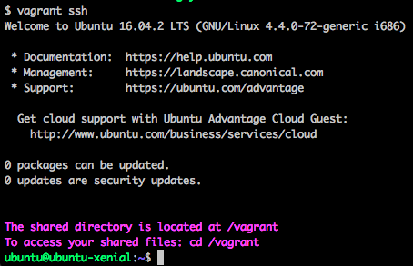

# Your assignment: Build it

Your task is to create a reporting tool that prints out reports (in plain text) based on the data in the database. This reporting tool is a Python program using the `psycopg2` module to connect to the database.

## So what are we reporting, anyway?

Here are the questions the reporting tool should answer. The example answers given aren't the right ones, though!

**1. What are the most popular three articles of all time?** Which articles have been accessed the most? Present this information as a sorted list with the most popular article at the top.

**Example:**

- "Princess Shellfish Marries Prince Handsome" — 1201 views
- "Baltimore Ravens Defeat Rhode Island Shoggoths" — 915 views
- "Political Scandal Ends In Political Scandal" — 553 views

**2. Who are the most popular article authors of all time?** That is, when you sum up all of the articles each author has written, which authors get the most page views? Present this as a sorted list with the most popular author at the top.

**Example:**

- Ursula La Multa — 2304 views
- Rudolf von Treppenwitz — 1985 views
- Markoff Chaney — 1723 views
- Anonymous Contributor — 1023 views

**3. On which days did more than 1% of requests lead to errors?** The log table includes a column status that indicates the HTTP status code that the news site sent to the user's browser. (Refer to [this lesson](https://classroom.udacity.com/courses/ud303/lessons/6ff26dd7-51d6-49b3-9f90-41377bff4564/concepts/75becdb9-da2a-4fbf-9a30-5f3ccd1aa1d6) for more information about the idea of HTTP status codes.)

**Example:**

- July 29, 2016 — 2.5% errors

## Good coding practices

### SQL style

Each one of these questions can be answered with a single database query. Your code should get the database to do the heavy lifting by using joins, aggregations, and the `where` clause to extract just the information you need, doing minimal "post-processing" in the Python code itself.

In building this tool, you may find it useful to add views to the database. You are allowed and encouraged to do this! However, if you create views, make sure to put the **create view** commands you used into your lab's README file so your reviewer will know how to recreate them.

### Python code quality

Your code should be written with good Python style. The [PEP8 style guide](https://www.python.org/dev/peps/pep-0008/) is an excellent standard to follow. You can do a quick check using the `pep8` command-line tool.

# Review your skills

Completing this project will exercise your database skills. Here are some portions of the Relational Databases course that you might want to review:

- [Joining tables](https://classroom.udacity.com/courses/ud197/lessons/3415228765/concepts/33932188550923)
- [The **`select ... where`** statement](https://classroom.udacity.com/courses/ud197/lessons/3423258756/concepts/33885287000923)
- [Select clauses](https://classroom.udacity.com/courses/ud197/lessons/3423258756/concepts/33885287080923)
- [Writing code with DB-API](https://classroom.udacity.com/courses/ud197/lessons/3483858580/concepts/35153985360923)
- [Views](https://classroom.udacity.com/courses/ud197/lessons/3490418600/concepts/35140186650923)

### The PostgreSQL documentation

In this project, you'll be using a PostgreSQL database. If you'd like to know a lot more about the kinds of queries that you can use in this dialect of SQL, check out the PostgreSQL documentation. It's a lot of detail, but it spells out _all the many things_ the database can do.

Here are some parts that may be particularly useful to refer to:

- [The select statement](https://www.postgresql.org/docs/9.5/static/sql-select.html)
- [SQL string functions](https://www.postgresql.org/docs/9.5/static/functions-string.html)
- [Aggregate functions](https://www.postgresql.org/docs/9.5/static/functions-aggregate.html)

# Prepare the software and data

To start on this project, you'll need database software (provided by a Linux virtual machine) and the data to analyze.

## The virtual machine

This project makes use of the same Linux-based virtual machine (VM) as the preceding lessons.

If you skipped those lessons and came right to this project, that's OK! However, you will need to go back to the instructions to install the virtual machine. Please see previous lessons to complete the installation process.

This will give you the PostgreSQL database and support software needed for this project. If you have used an older version of this VM, you may need to install it into a new directory.

If you need to bring the virtual machine back online (with `vagrant up`), do so now. Then log into it with `vagrant ssh`.

|  | 
|:--:| 
| [_Successfully logged into the virtual machine._    ](https://classroom.udacity.com/nanodegrees/nd004-mena/parts/a8609286-c119-4bc5-b9c9-2a3828080114/modules/56f0f4c7-d611-4949-b8d5-e1b9df12d95f/lessons/d128b204-9a5c-4547-8599-b3983d06911b/concepts/a9cf98c8-0325-4c68-b972-58d5957f1a91#) |

## Download the data

Next, [download the data here.](https://d17h27t6h515a5.cloudfront.net/topher/2016/August/57b5f748_newsdata/newsdata.zip) You will need to unzip this file after downloading it. The file inside is called `newsdata.sql`. Put this file into the `vagrant` directory, which is shared with your virtual machine.

To build the reporting tool, you'll need to load the site's data into your local database. Review how to use the `psql` command in this lesson: [(FSND version)](https://classroom.udacity.com/nanodegrees/nd004-mena/parts/a8609286-c119-4bc5-b9c9-2a3828080114/modules/56f0f4c7-d611-4949-b8d5-e1b9df12d95f/lessons/4cff95e1-3f1c-435a-bc6c-40fcf0d8f884/concepts/0b4079f5-6e64-4dd8-aee9-5c3a0db39840)

To load the data, `cd` into the `vagrant` directory and use the command `psql -d news -f newsdata.sql`.  
Here's what this command does:

- `psql` — the PostgreSQL command line program
- `-d news` — connect to the database named news which has been set up for you
- `-f newsdata.sql` — run the SQL statements in the file newsdata.sql

Running this command will connect to your installed database server and execute the SQL commands in the downloaded file, creating tables and populating them with data.

### Getting an error?

If this command gives an error message, such as —  

`psql: FATAL: database "news" does not exist`

`psql: could not connect to server: Connection refused`

— this means the database server is not running or is not set up correctly. This can happen if you have an _older version_ of the VM configuration from before this project was added. To continue, [download the virtual machine configuration](https://classroom.udacity.com/nanodegrees/nd004-mena/parts/a8609286-c119-4bc5-b9c9-2a3828080114/modules/56f0f4c7-d611-4949-b8d5-e1b9df12d95f/lessons/e168714c-3584-4569-bd1f-3d623c07b0ac/concepts/14c72fe3-e3fe-4959-9c4b-467cf5b7c3a0) into a fresh new directory and start it from there.

## Explore the data

Once you have the data loaded into your database, connect to your database using `psql -d news` and explore the tables using the `\dt` and `\d` table commands and `select` statements.

- `\dt` — display tables — lists the tables that are available in the database.
- `\d` table — (replace _table_ with the name of a table) — shows the database schema for that particular table.

Get a sense for what sort of information is in each column of these tables.

The database includes three tables:

- The `authors` table includes information about the authors of articles.
- The `articles` table includes the articles themselves.
- The `log` table includes one entry for each time a user has accessed the site.

As you explore the data, you may find it useful to take notes! Don't try to memorize all the columns. Instead, write down a description of the column names and what kind of values are found in those columns.

### Connecting from your code

The database that you're working with in this project is running PostgreSQL, like the `forum` database that you worked with in the course. So in your code, you'll want to use the `psycopg2` Python module to connect to it, for instance:

`db = psycopg2.connect("dbname=news")`
