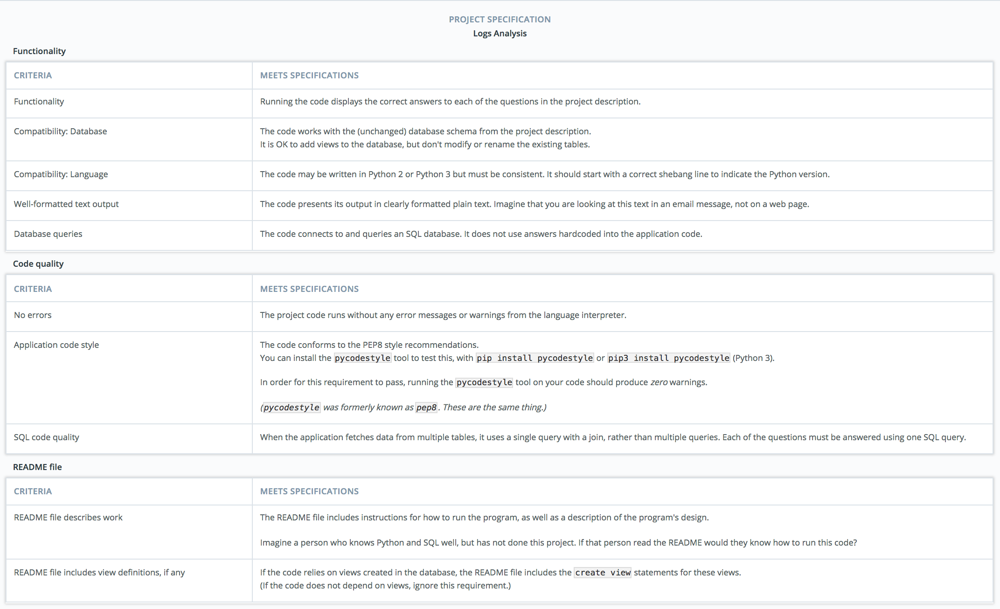

### Project Submission

## 

Once you've completed the project, submit it for review.

[Take a look at the project rubric here.](https://review.udacity.com/#!/rubrics/277/view) These are the code standards that your reviewer will be using to evaluate your code.

Your submission should include:

- **Your program's source code.** Usually this will be one source code file.
- **An example of your program's output.** This will be a plain text file that is a copy of what your program printed out.
- **A README.md file** This is a Markdown text file in which you describe the design of your code and how to run it. If you created any views in the database, make sure to put the create view commands into the README file. For more information on writing good READMEs, see [this course](https://classroom.udacity.com/courses/ud777).

You do not need to include the database, the newsdata.sql file, or any other files besides these.
